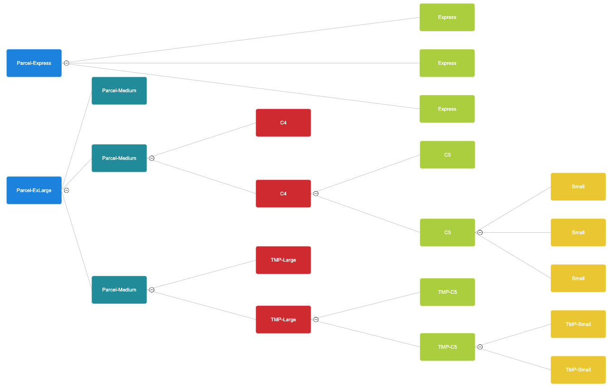

# semi-automated label generator
## _Quick walkthrough_
1. The script is split into 2 parts for ease of debugging and tracing problems with custom labels from raw CSVs
2. `generateLabels.py` will take in up to 4 platforms' csv to sanitize, outputting `standardized_columns.csv`
3. `merge.py` will take `standardized_columns.csv` and merge all orders with the same ID or same address and receiver into a single label, outputting `merged_labels.csv`
4. To use this, simply extract the zip anywhere and replace the "_orders.csv" with your own and execute `generateLabels.py` then once it is complete (`standardized_columns.csv` appears), run `merge.py`. 

#### `generateLabels.py`

> this script will deal with everything WITHIN a row
- this script requires the raw CSVs to be named as `<platform>`_orders.csv
- eg. eBay_orders.csv, Catch_orders.csv
- anything ending in "_orders.csv" WILL BE READ, so avoid this name for other files that might exist in the folder

#### `merge.py`
> this script will deal with everything involving multiple rows, hence the name merge
- this script requires the previous step CSV to be named exactly `standardized_columns.csv`
- if any unrecognisable envelope names are found, Error will be appended to its name
- this operates with the assumption as below
```
untracked:
every 3 small will be equivalent to 1 c5 
every 2 c5 will be equivalent to 1 c4
every 2 c4 will be equivalent to 1 parcel-medium
every 3 parcel-medium = 1 parcel exlarge

tracked:
every 2 tmp-small will be equivalent to 1 tmp-c5 
every 2 tmp-c5 will be equivalent to 1 parcel-medium
every 3 parcel-medium = 1 parcel exlarge

express:
every 3 express = 1 parcel-express
```
- it operates based on MINIMUM capacity, as defined in the files, and all computation is literally just summing the MINIMUM required capacity, then picking the closest one (capacity of 30 will return Parcel-Medium rather than Parcel-ExLarge)
- skips everything with only 1 packaging (no need to waste time computing merge with nothing)
- skips ? (please fix in listings)
- hierarchy diagram 


## HOW TO RUN
1. Download the latest Python (At the time of writing, I used python 3.13) https://www.python.org/downloads/
2. Open CMD or terminal in the location you extracted the files to
3. doing `ls` in the cmd or terminal should show you the .py files
4. in terminal or cmd:
```
python3 generateLabels.py && python3 merge.py
```

## If your computer cannot recognize python as a runnable
#### Windows Instructions
1. Open Environment Variables
> Press Win + S and search for Environment Variables.
Select Edit the system environment variables.
In the System Properties window, click Environment Variables.
2. Set a New Environment Variable
> Under User variables or System variables, click New.
Fill in:
Variable Name: (e.g., PYTHONPATH)
Variable Value: Add the path to the directory containing your Python files, separated by semicolons (;) if there are multiple paths (the path to your python3 FOLDER, the one holding your python executable). Example:
```bash
C:\Python39\python.exe
```
3. Edit an Existing Variable (Optional)
> Find an existing variable like PYTHONPATH.
Click Edit and append the directory path, separated by a semicolon (;).
4. Save and Apply
> Click OK to save changes.
Restart any open Command Prompt, PowerShell, or IDE for the changes to take effect.

#### macOS/Linux Instructions
1. Set a Permanent Environment Variable
>Open your shell configuration file:
For Bash: ~/.bashrc or ~/.bash_profile
For Zsh: ~/.zshrc
Add the following line: (the path to your python3 FOLDER, the one holding your python executable)
```bash
export PYTHONPATH=$PYTHONPATH:/usr/bin/python3
```
> Save the file and reload it:
```bash
source ~/.bashrc
```
or
```bash
source ~/.zshrc
```

#### Pre-requisites
Once python has been installed, do 
```bash 
python3 -m ensurepip --upgrade
```
to install the python package manager, which allows you to install dependencies easily, then once done, do:
```bash
pip install pandas
```
To use the startup script without typing commands, please make sure to paste this in powershell as ADMIN
```bash
Set-ExecutionPolicy RemoteSigned
```
